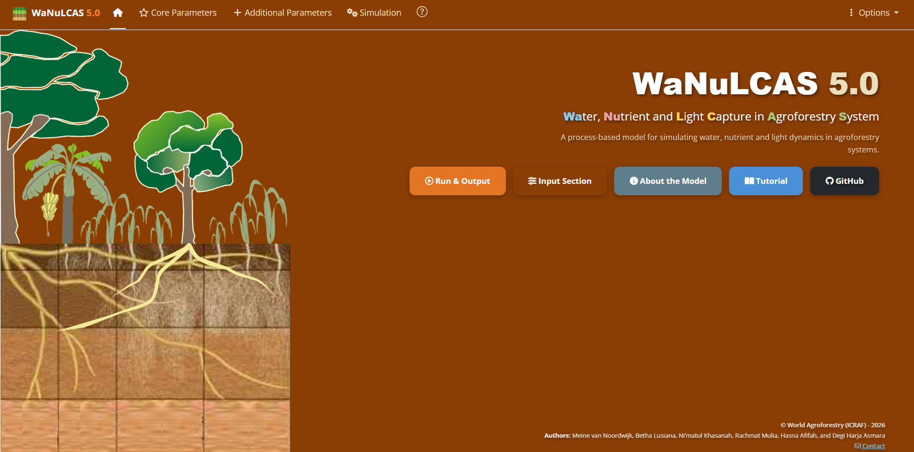

# WaNuLCAS 5.0
***Wa**ter, **Nu**trient and **L**ight **C**apture in **A**groforestry Systems*

This application provides a comprehensive interface for simulating agroforestry scenarios.

## Running the Application

There are several ways to access and run the WaNuLCAS Shiny application:

### 1. Online Access (Easiest)
You can directly access the application online without any installation at:
[https://wanulcas.agroforestri.id/](https://wanulcas.agroforestri.id/)

### 2. Run Directly from GitHub
To run the application locally without cloning the repository, open your R console or RStudio and run:

```r
# Install shiny if you haven't already
if (!require("shiny")) install.packages("shiny")

# Run the application from the GitHub repository
shiny::runGitHub("wanulcas", "talas-tools")
```

### 3. Run Locally (Clone/Download)
If you prefer to have the source code on your machine:
1. Clone the repository: `git clone https://github.com/degi/wanulcas.git`
2. Open the project in RStudio or set your working directory to the downloaded folder.
3. Open `app.R` (or `ui.R`/`server.R`) and click **Run App** in RStudio, or run `shiny::runApp()` in your R console.

## User Manual
User manual and model documentation are available at: https://talas-tools.github.io/wanulcas/ 

WaNuLCAS simulates the balance of water, nutrients, and light capture in agroforestry systems dynamically over time. The application is divided into several main sections accessible via the navigation bar:
- **Home**: Main landing page
- **Input Parameters**: Define the characteristics of your system (Soil, Climate, Plants, etc.)
- **Simulation**: Run scenarios and analyze outcomes
- **About**: View tutorials, libraries, and references


