# WaNuLCAS 5.0 — User Manual

**Water, Nutrient and Light Capture in Agroforestry Systems**

Version 5.0 Web Application

Authors: Meine van Noordwijk, Betha Lusiana, Ni'matul Khasanah, Rachmat Mulia, Hasna Afifah, Degi Harja Asmara

---

## Table of Contents

1. [Getting Started](#1-getting-started)
2. [Home Page](#2-home-page)
3. [Core Parameters](#3-core-parameters)
4. [Additional Parameters](#4-additional-parameters)
5. [Simulation](#5-simulation)
6. [Output & Results](#6-output--results)
7. [Options](#7-options)
8. [Frequently Asked Questions](#8-frequently-asked-questions)
---
## 1. Getting Started

WaNuLCAS simulates the balance of water, nutrients, and light capture in agroforestry systems dynamically over time. The web application provides an interactive interface to configure, run, and visualize simulations.

Before proceeding with this User Manual, please ensure you have read the **Overview** chapter to understand the model configuration. The Overview chapter explains the scientific foundations of the model, including its key features (water, nitrogen, and phosphorus uptake based on root length densities), the 4-zone × 4-layer spatial design, the calendar of events, and the underlying modules for soil processes, light competition, crop/tree growth, and economic analysis. Understanding these concepts will help you make informed choices when setting up your simulation parameters.

The input and output parameters in this web application are largely represented by acronyms. To see the detailed description of each parameter, the full parameter description documents are available for download from the **Options** tab (both input and output parameter descriptions are provided as PDF files).

### 1.1 Accessing the Application

**Online (easiest):** Open [https://wanulcas.agroforestri.id/](https://wanulcas.agroforestri.id/) in your browser (Chrome, Firefox, or Edge recommended).

**Run from GitHub:**
```r
if (!require("shiny")) install.packages("shiny")
shiny::runGitHub("wanulcas", "icraf-indonesia")
```

**Run locally:**
1. Clone: `git clone https://github.com/icraf-indonesia/wanulcas.git`
2. Open in RStudio and click **Run App**, or run `shiny::runApp()`.

### 1.2 Navigation

The application has five main tabs at the top:

| Tab | Purpose |
|-----|---------|
| **Home** | Overview and quick navigation |
| **Core Parameters** | Essential model inputs (tree, crop, climate, soil), mandatory to be filled |
| **Additional Parameters** | Advanced settings (management, economics, SOM, slash & burn, etc.) |
| **Simulation** | Run the model and view results |
| **Options** | Upload/download input parameter, download the parameter template & descriptions |

### 1.3 Three Ways to Use the Model

There are three ways to input data into WaNuLCAS. Regardless of which method you choose, the last change you make in this web app is always the one that will be used — if you upload from Excel and then modify a value on the website, the website value takes precedence.

**Method 1: Direct input through the application (recommended for new users)**

Enter all parameters manually in the app. The input tables throughout the application support copy-paste from Excel — select a block in your spreadsheet, copy (Ctrl+C), click the first cell in the web table, and paste (Ctrl+V). This method gives you full control and immediate visual feedback on every parameter.

**Method 2: Import from Excel (most recommended, especially for existing WaNuLCAS users)**

If you have used WaNuLCAS before (the STELLA version) or prefer working in Excel, download the blank template from **Options > Download xlsm template**, fill it in offline, and upload it via **Options > Upload xlsm file**. If you already have a `Wanulcas.xlsm` file from a previous study, you can upload it directly without starting from the blank template. All Core Parameters will be loaded automatically. If you need to set Additional Parameters (which were previously part of the STELLA interface), you can configure those directly in the app after uploading the Excel file.

Please note that any changes you make on the website after uploading will override the data from your Excel file. For example, if you use the Pedotransfer or Phosphorus calculators after uploading, the computed values will replace the corresponding Excel values — even though the input tables may still display the original Excel numbers, the engine will use the most recently applied values.

**Method 3: Import from YAML (least recommended)**

You can also import parameters from a `.yaml` file (available via **Options > Download and save parameters**). This is primarily useful for saving and restoring a specific configuration you have previously set up in the app, rather than for initial data entry.

---

## 2. Home Page

Figure 2.1: Home page


The Home page provides quick-access buttons:

- **Run & Output** — Jump directly to the Simulation page
- **Input Section** — Reveals the module navigation cards below
- **About the Model** — Background information
- **Tutorial** — Learning resources and details on how to use the application

Figure 2.2: Home page with module cards
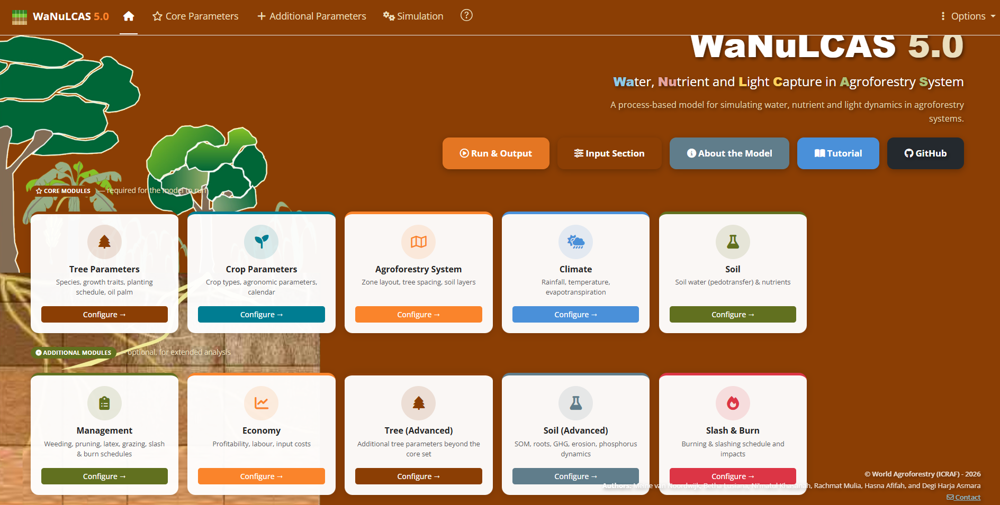

Clicking **Input Section** reveals cards for each parameter group (Tree, Crop, Agroforestry System, Climate, Soil). Click any card to jump to that section.

---

## 3. Core Parameters

Core Parameters are **mandatory** — every part of Core Parameters must be filled in for WaNuLCAS to be able to run a simulation. This section covers the essential inputs: species selection, agroforestry layout, climate, and soil.

### 3.1 Tree Parameters

#### Tree Management (Species Selection & Planting)

Select up to 3 tree species from the dropdown menus at the top. Species data is loaded from a built-in library of 39 species (including oil palm variants, rubber, cacao, and many others).

Figure 3.1: Tree species selection and planting schedule
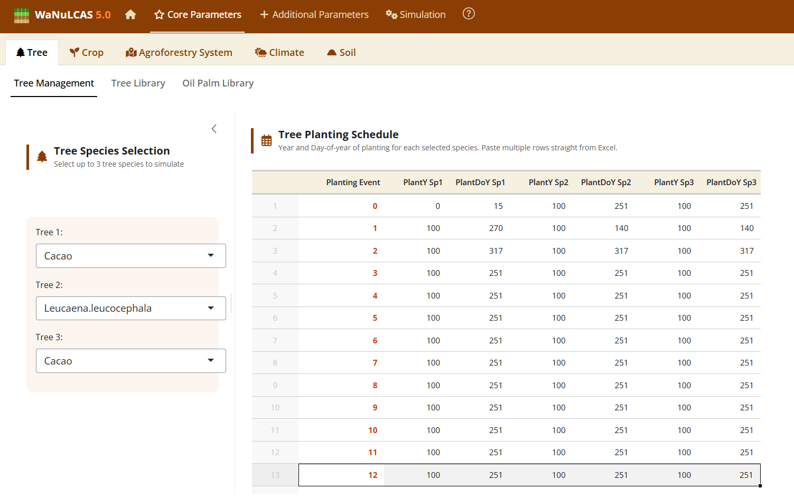

Below the species selection, the **Tree Planting Schedule** table lets you set the planting year and day-of-year for each species. This is a paste-capable table — you can copy rows from Excel, click the first cell, and paste.

At the bottom of this page, there is a **"Go to Pruning Event"** button that takes you directly to the pruning settings in Additional Parameters.

#### Tree Library

Figure 3.2: Tree library
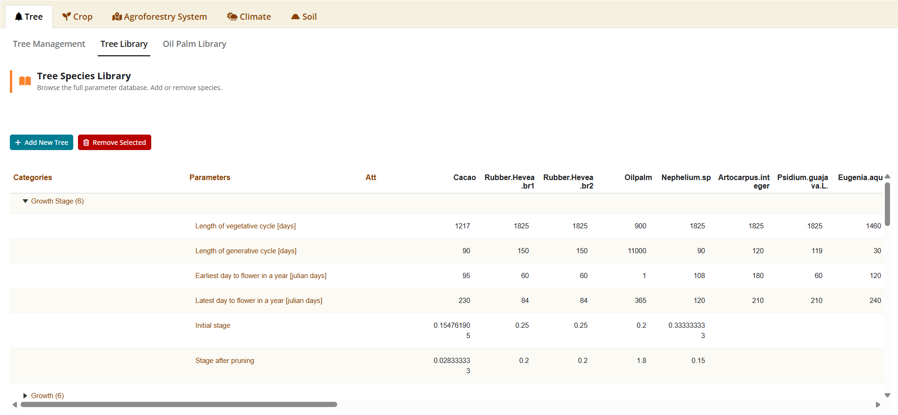

The Tree Library displays all available tree species parameters in an editable table. Rows represent parameters (grouped by category such as Growth, Allometry, Phenology, etc.), and columns represent species. Fields include light capture indicators (`T_SLA`, `T_LWR`) used to calculate the Tree Leaf Area Index, and rooting strategies (`Rt_ATType`) that dictate how tree root length density is distributed across soil profiles. You can browse and edit values directly, select a species as a base, or add/remove custom species.

If you need to parameterize a new species from an existing one, you can add a new tree using an existing species as a base and then edit the parameter values manually. You can name the new species, and after you confirm, it will become available in the Tree Species Selection dropdowns on the Tree Management page — you will need to select it there manually to use it in the simulation.

#### Oil Palm Library

Figure 3.3: Oil Palm library
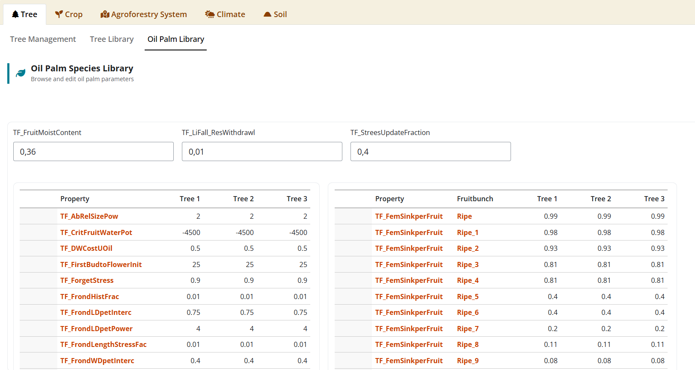

This section provides additional parameterization if you are modelling oil palm. Each TF (tree fruit) property has its own fruit bunch stages, and values are filled per tree.

For parameters that vary by fruit bunch stage (like `TF_FemSinkperFruit`, `TF_MaleSinkperBunch`), the table shows two row labels — **Property** and **Fruitbunch** (e.g., Ripe, Ripe_1, Anthesis) — with Tree columns for each.

---

### 3.2 Crop Parameters

#### Crop Management

Figure 3.4: Crop species selection and planting schedule
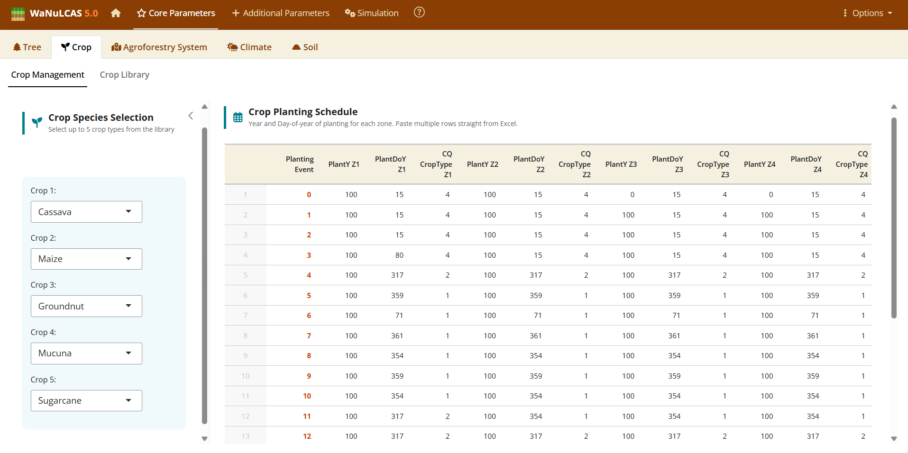

Select up to 5 crop types from the dropdown menus. The selected crop type determines the crop stage, physiological parameters, and other properties (explained in the Crop Library) linked to the model.

The **Crop Planting Schedule** combines three pieces of information per zone in one table. There are four zones, and each column is labelled accordingly:

| Planting Event | PlantY Z1 | PlantDoY Z1 | CQ CropType Z1 | PlantY Z2 | ... |
|---|---|---|---|---|---|

`PlantY Z1` is the year you planted in Zone 1, `PlantDoY Z1` is the day of year for planting in Zone 1, and `CQ CropType Z1` sets which crop species (by number, referencing your selected crop list) is planted in Zone 1 for each planting event. The same pattern repeats for Zones 2, 3, and 4.

#### Crop Library

Figure 3.5: Crop library
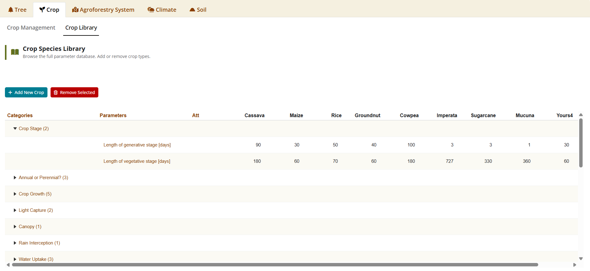

Browse and edit crop-specific parameters. You can also add or remove species directly within the library.

---

### 3.3 Agroforestry System

#### Agroforestry Design

Figure 3.6: WaNuLCAS zone and layer diagram
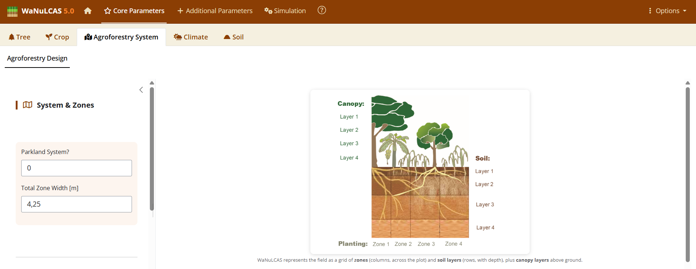

This page controls the spatial layout of the agroforestry system. At the top, a diagram shows the WaNuLCAS structure:

- **Zones** (1–4) = horizontal divisions of the plot (columns), originating from the tree line. The model calculates the spatial distribution of light, water, and nutrient competition between tree and crop root systems over radial distance.
- **Soil Layers** (1–4) = vertical divisions of the soil (rows by depth)
- **Canopy Layers** (1–4) = vertical divisions of the canopy above ground

The design page also includes:

- **Parkland System?** — a switch (1 or 0). If **1**, the system is modelled as a parkland/circular design; if **0**, it is modelled as linear or alley cropping.
- **Total Zone Width** — the total width of the field being modelled, spread across the 4 zones.

Figure 3.7: WaNuLCAS zone depth and layer thickness
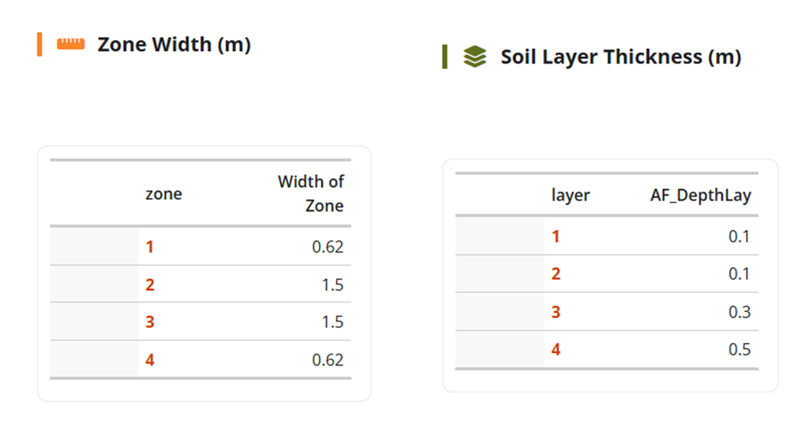

- **Zone Width** — the width of each zone being modelled, spread across the 4 zones.
- **Soil Layer Thickness** — the depth of each soil layer being modelled, spread across the 4 layer.

Figure 3.8: Tree placement and zone configuration
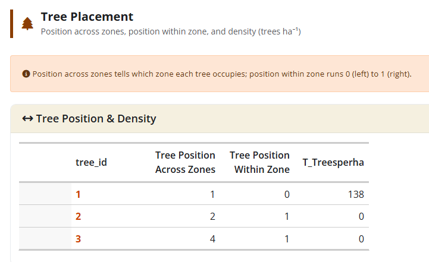

Below the diagram are tables for tree placement and zone/layer configuration:

- **Position across zones** — tells which zone each tree occupies.
- **Position within zone** — a value from 0 (left) to 1 (right), indicating where within its zone the tree is placed.
- **T_Treesperha** — the number of trees per hectare for each tree species.
- **Zone widths** and **layer depths** — the width of each of the 4 zones and the thickness of each of the 4 soil layers.

---

### 3.4 Climate

In most of this chapter and beyond, you will see inputs presented in a box with **Graph** and **Data** tabs. You can zoom into the graph, edit the underlying data, and immediately see how the graph changes in response.

#### Temperature > Air Temperature

Figure 3.9: Air temperature
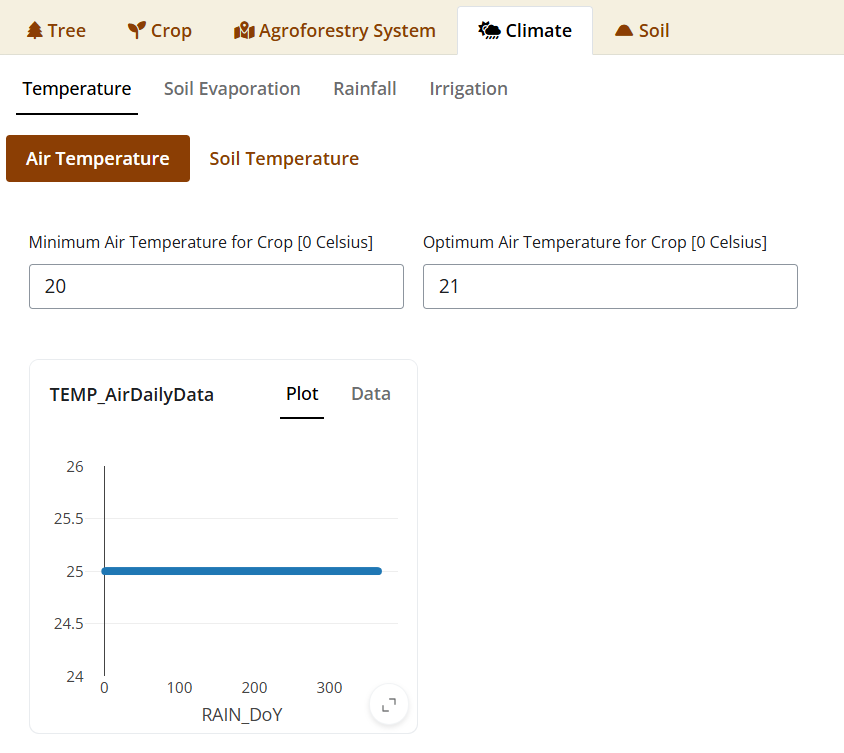

Set crop minimum temperature (`C_TMin`), optimum temperature (`C_TOpt`), and the daily air temperature curve (`TEMP_AirDailyData`) which has 365 data points (one per day), influencing potential evaporation and plant growth.

#### Temperature > Soil Temperature

Figure 3.10: Soil temperature guided options
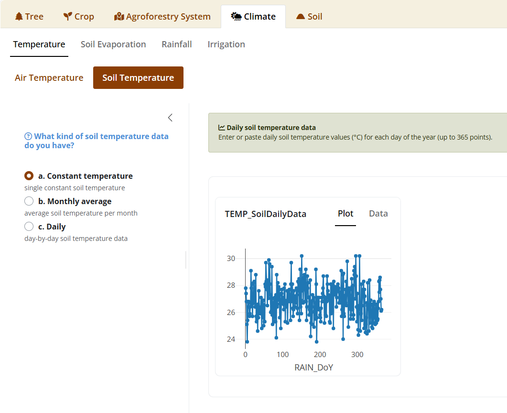

A guided sidebar asks: **"What kind of soil temperature data do you have?"**

| Option | What to enter | Engine setting |
|---|---|---|
| **a. Constant temperature** | A single constant soil temperature (°C) | TEMP_AType = 1 |
| **b. Monthly average** | Average soil temperature per month (12-point curve) | TEMP_AType = 2 |
| **c. Daily** | Day-by-day soil temperature values (up to 365 points) | TEMP_AType = 3 |

Each option shows a blue info box describing what to input, followed by the appropriate input field or graph editor. Ensure you choose the option that matches the type of soil temperature data you actually have — the model will calculate using only the data for the option you select. This selection is also updated automatically if you import data from an Excel file.

#### Soil Evaporation

Figure 3.11: Soil evaporation guided options
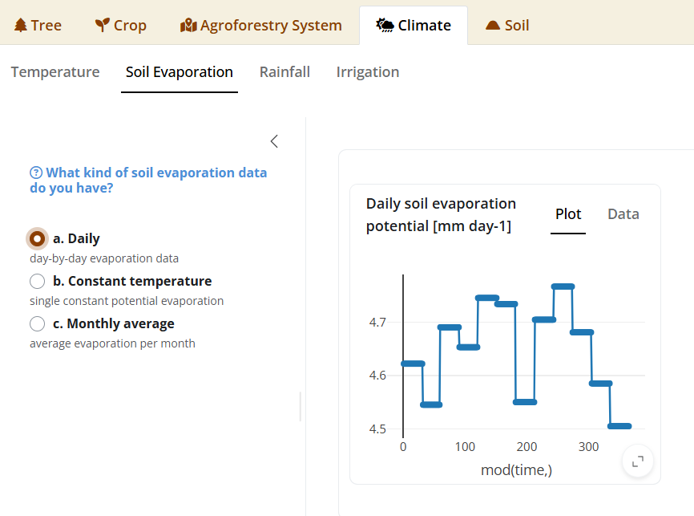

A guided sidebar asks: **"What kind of soil evaporation data do you have?"**

| Option | Description |
|---|---|
| **a. Daily** | Day-by-day potential evaporation data |
| **b. Constant temperature** | A single constant potential evaporation rate |
| **c. Monthly average** | Monthly mean evaporation values |

As with Soil Temperature, the model will calculate using only the data for the option you select, so choose the option that matches the data you have.

#### Rainfall

Figure 3.12: Rainfall guided options
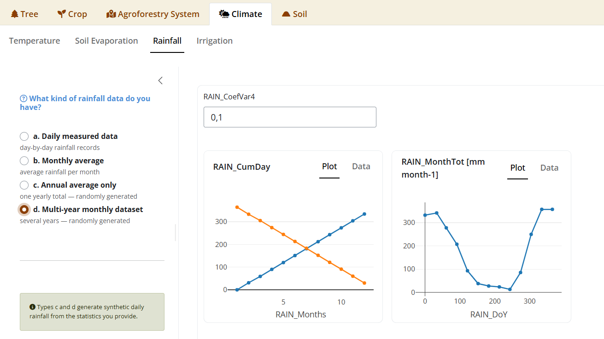

A guided sidebar asks: **"What kind of rainfall data do you have?"** For regions without complete records, the integrated rainfall simulator uses Markov chains determining conditional probability for rainy days (e.g., `P(W|D)`, `P(W|W)`) paired with distribution models to simulate localized storm intensities. As with the other guided pages, the model will calculate using only the data for the option you select.

| Option | Description | RAIN_AType |
|---|---|---|
| **a. Simulated monthly** | Stochastic daily rain from monthly stats | 1 |
| **b. Monthly average** | Average monthly rainfall directly | 2 |
| **c. Random generator** | Random rain using statistical parameters | 3 |
| **d. Daily rainfall data** | Actual daily values (365 points) | 4 |

#### Irrigation

Figure 3.13: Irrigation
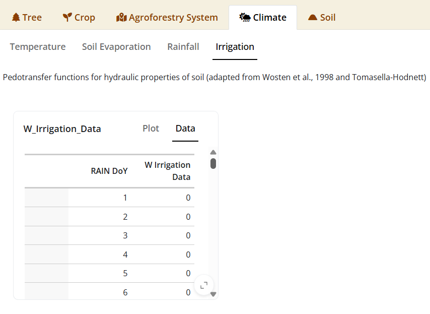

Set irrigation schedule and amounts (if applicable).

---

### 3.5 Soil

#### Soil Nutrient > Nitrogen

Figure 3.14: Nitrogen parameters (Layer × Zone matrix)
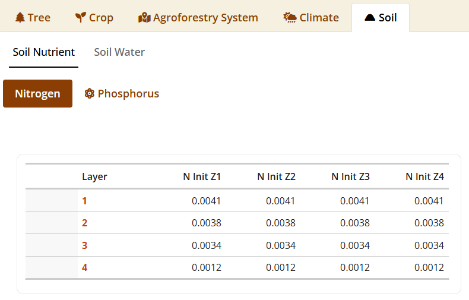

Configure initial Nitrogen stocks (`N_Init`) for each soil layer and zone. Tables display values with **4 decimal places** (other tabs use 2) because nitrogen parameters require higher precision.

#### Soil Nutrient > Phosphorus (Calculator)

Figure 3.15: Phosphorus sorption calculator
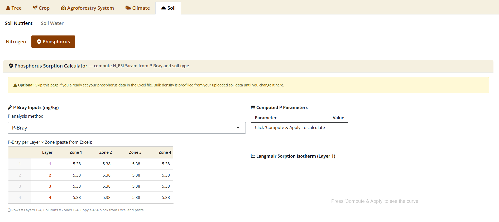

Skip this page if you already set your phosphorus data in the Excel file. Bulk density and other parameters on this page are pre-filled from your uploaded soil (Excel) data until you change them here — once you click **"Compute & Apply"**, the computed values will override the data from your Excel input.

The **Phosphorus Sorption Calculator** computes phosphorus availability parameters from P-Bray measurements:

- A **4×4 paste-capable P-Bray table** (rows = Layers, columns = Zones)
- Per-layer soil type selection (from 13 Indonesian soil types or custom)
- Per-layer bulk density inputs

Clicking **"Compute & Apply"** calculates `N_PStParam` (16 values), `PStMin`, and `PStMax`, and writes them into the model. The model simulates how nutrient stocks mineralize or become adsorbed (governed by the Langmuir sorption isotherm).

Figure 3.16: Phosphorus results
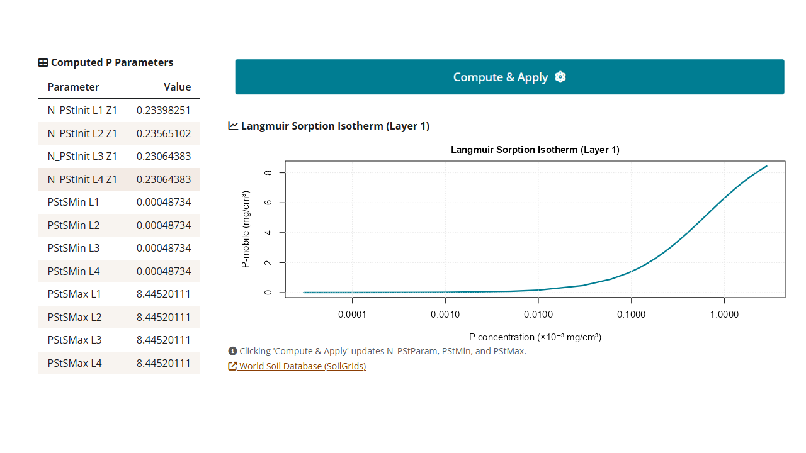

#### Soil Water > Pedotransfer (Calculator)

Figure 3.17: Pedotransfer calculator input table
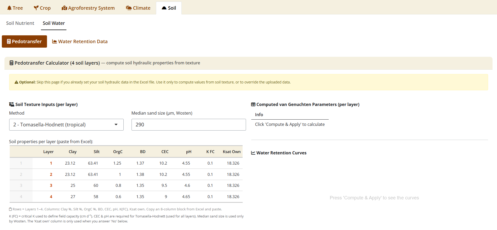

Just like the Phosphorus Calculator, the Pedotransfer input data is auto-filled from your uploaded Excel data until you click **"Compute & Apply"** here — once you do, the computed values will override the data from your Excel input.

The **Pedotransfer Calculator** computes soil hydraulic parameters (van Genuchten equation linking volumetric water content with potential head, and saturated hydraulic conductivity) from soil texture data. It features a **paste-capable input table** with 4 rows (one per soil layer) and 8 columns:

| Column | Description |
|---|---|
| Clay % | Clay fraction |
| Silt % | Silt fraction |
| OrgC % | Organic carbon content |
| BD | Bulk density (g/cm³) |
| CEC | Cation exchange capacity (required for Tomasella-Hodnett) |
| pH | Soil pH (required for Tomasella-Hodnett) |
| K(FC) | Critical K defining field capacity (cm/day) |
| Ksat own | Your own saturated conductivity estimate |

**Method selection:**
- Method 1: **Wosten** (temperate soils) — also uses Median Sand Particle Size
- Method 2: **Tomasella-Hodnett** (tropical soils) — also uses CEC and pH per layer

**"Use the PTF estimate of Ksat?"**
- **Yes** → apply the Ksat calculated from your soil texture
- **No** → apply your own value from the "Ksat own" column

Figure 3.18: Pedotransfer results and retention curves
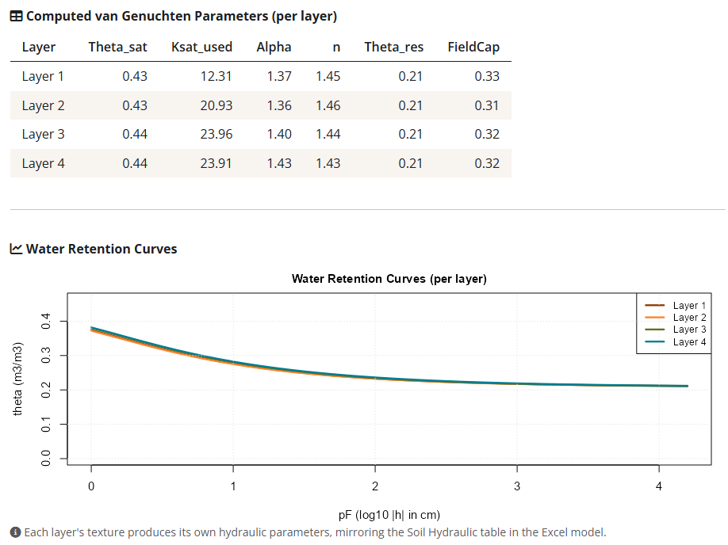

Results show per-layer Theta_sat, Ksat_used (the value actually applied), Alpha, n, Theta_res, and Field Capacity, with water retention curves plotted per layer.

#### Soil Water > Water Retention Data

Figure 3.19: Water retention data
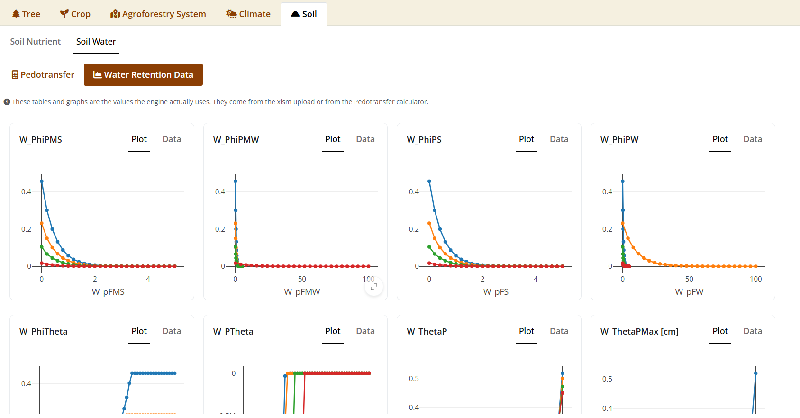

View and edit the van Genuchten water retention curve parameters per layer.

---

## 4. Additional Parameters

Additional Parameters are **optional**. They contain advanced settings that most users won't need to change unless they have a specific purpose for the model, such as detailed management scheduling or economic analysis. They are organized into four groups.

### 4.1 Tree (Advanced)

Figure 4.1: Advanced Tree Parameters
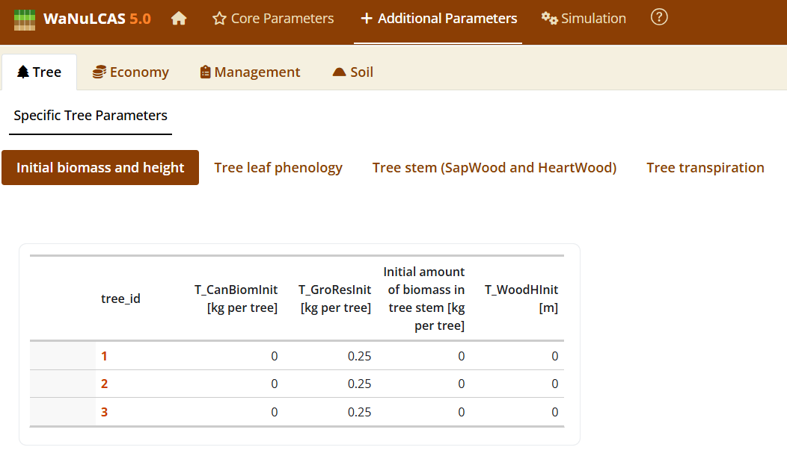

Fine-tune tree-specific physiological starting conditions and internal processes beyond what is set in the Tree Library:

- **Initial biomass and height** — Starting above- and below-ground biomass, initial stem diameter, and canopy height for each selected tree species at the start of the simulation.
- **Tree leaf phenology** — Timing and pattern of leaf flushing, seasonal leaf shedding, and deciduousness, which affects light interception and photosynthesis over time.
- **Tree stem (SapWood and HeartWood)** — Parameters controlling how much of the stem is active sapwood versus heartwood, which affects water transport capacity and wood biomass accounting.
- **Tree transpiration** — Advanced parameters governing how trees respond to water availability and atmospheric demand during transpiration.

### 4.2 Economy

Figure 4.2: Profitability and price table
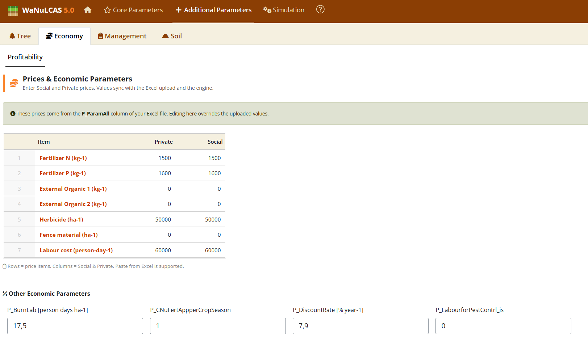

The **Profitability** page lets you evaluate the economic performance of your agroforestry design. It features a **merged Social/Private price table** (Item | Private | Social) covering fertilizer costs (N, P), external organic inputs, herbicide, fencing, and labour costs — "Private" prices reflect what a farmer actually pays or receives, while "Social" prices reflect the wider societal value (useful for policy-level cost-benefit analysis). The module calculates the Net Present Value (NPV) and returns to labor over the simulation period, letting you compare the financial viability of different tree-crop combinations or management strategies.

### 4.3 Management

Figure 4.3: Management sub-tabs
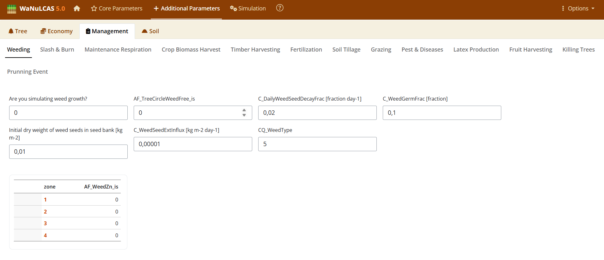

The Management group lets you schedule specific field operations and events over the course of the simulation, each affecting biomass, nutrient, or water pools at the time they occur:

| Sub-tab | What it controls |
|---|---|
| Weeding | Weeding schedule and intensity — when weeds are removed and how completely, affecting competition for light, water, and nutrients. |
| Slash & Burn | Burning calendar, ash effects, fire impacts. WaNuLCAS simulates fire consequences: volatilizing nitrogen, heat-related mortality of weed seedbanks, and depositing mineral nutrients into topsoil. |
| Fertilization | Timing and quantity of inorganic and organic fertilizer inputs applied to specific zones. |
| Timber Harvesting | Wood harvest strategies, including harvest year and the fraction of tree biomass removed. |
| Fruit Harvesting | Timing and fraction of fruit harvested for fruit-bearing tree species. |
| Latex Production | Rubber tapping parameters, including tapping frequency and latex yield per tap. |
| Prunning Event | Pruning schedule and intensity per tree species (also accessible via the "Go to Pruning Event" button on the Tree Management page). |
| Grazing | Animal stocking rates, daily feed demand, and standard livestock units for systems that include grazing. |
| Soil Tillage | Tillage schedule and its effect on soil structure and organic matter turnover. |
| Pest & Diseases | Timing and severity of pest or disease impacts on crop and tree growth. |
| Killing Trees | Schedule for tree removal (e.g., thinning or clear-felling) during the simulation. |

### 4.4 Soil (Advanced)

Figure 4.4: Advanced soil parameters sub-tabs
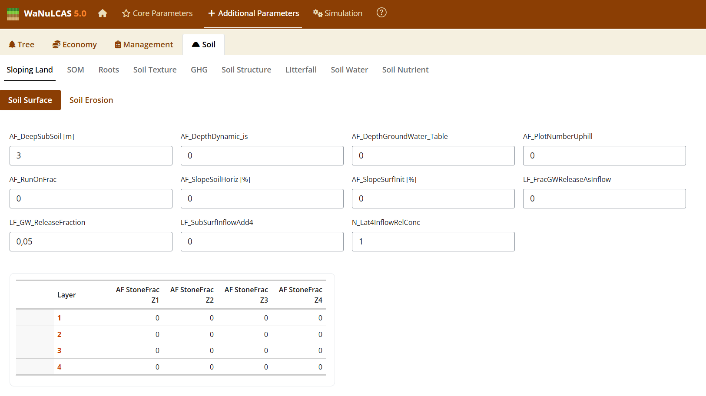

Advanced soil process parameters for users who want to fine-tune the underlying soil science beyond the Core Soil settings:

- **Sloping Land** — Surface conditions and erosion parameters for sloped terrain, affecting soil and nutrient redistribution across zones.
- **SOM** — Soil Organic Matter dynamics based on the Century model, with separate pools for different decomposition timescales (active, slow, passive, structural, metabolic) and their transfer fractions.
- **Litter Quality** — Properties of surface litter layers, litterfall rates, and litter quality indicators that regulate how quickly carbon and nutrients are released back into the soil.
- **Roots & Mycorrhiza** — Root length density distribution across zones and layers, plus the fraction of root length infected by mycorrhiza, which increases effective root length for phosphorus uptake.
- **Soil Texture** — Detailed sand/silt/clay composition per layer, used where texture-based calculations are needed beyond the Pedotransfer calculator.
- **GHG** — Greenhouse gas emission parameters (N₂O and CH₄ fluxes) arising from soil organic matter and litter decomposition.
- **Soil Water/Nutrient (additional)** — Supplementary water and nutrient parameters not covered in the Core Parameters, such as initial soil moisture and additional stock initialization values.

---

## 5. Simulation

### 5.1 Configuring a Run

Figure 5.1: Simulation page
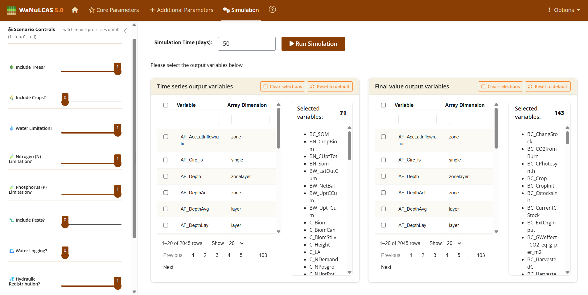

The left sidebar contains **scenario switches** (on/off toggles and sliders):

| Switch | Description | Default |
|---|---|---|
| 🌳 Include Trees? | Enable/disable tree growth | On (1) |
| 🌾 Include Crops? | Enable/disable crop growth | On (1) |
| 💧 Water Limitation? | Limit growth by water availability | On (1) |
| 🧪 N Limitation? | Limit growth by nitrogen | On (1) |
| 🧪 P Limitation? | Limit growth by phosphorus | On (1) |
| 🐛 Include Pests? | Enable pest/disease impacts | Off (0) |
| 🌊 Water Logging? | Enable waterlogging effects | Off (0) |
| 💦 Hydraulic Redistribution? | Enable hydraulic lift | Off (0) |
| 🌧️ Rain Multiplier | Scale rainfall (0–4×) | 1 |
| 📅 Simulation Days | Duration in days | 50 |
| 📅 Start Day of Year | Julian day to start | 14 |

### 5.2 Output Variable Selection

Two tables let you select which variables to track:

- **Time Series Output** — Variables recorded at every timestep (for graphs)
- **Final Output** — Variables recorded only at the end (for summary tables)

Variables are pre-checked based on the model's recommended defaults. Please click/add the parameters of your interest before running the model. The detailed description of each output abbreviation is in the output parameter description PDF, downloadable from the **Options** menu.

### 5.3 Running and Console Log

Click **"Run Simulation"**. The R console prints detailed diagnostics before each run — species selections, scenario switches, soil hydraulic parameters, and output variable counts. Check this whenever results look unexpected.

---

## 6. Output & Results

### 6.1 Time Series Output

Figure 6.1: Output theme tabs
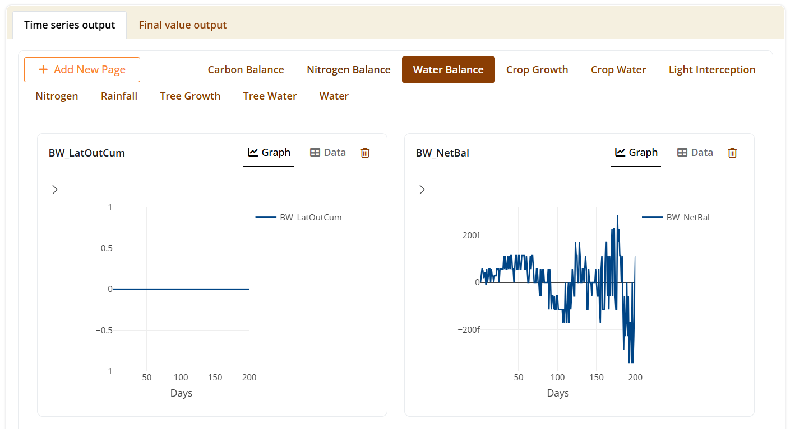

Results are grouped into **theme tabs**:

| Tab | Example Variables |
|---|---|
| Carbon Balance | BC_SOM |
| Nitrogen Balance | BN_CropBiom, BN_CUptTot, BN_Som |
| Water Balance | BW_LatOutCum, BW_NetBal, BW_UptCCum, BW_UptTCum |
| Crop Growth | C_Biom, C_BiomCan |
| Tree Growth | T_Biom, T_BiomAG, T_CanH, T_StemDiam, ... |
| Water | W_DrainCumV |
| Rainfall | Rain, RAIN_Cum |
| Economic Balance | P_TCostsTot, P_TReturnTot, P_NPV, ... |

Each card shows a plotly interactive graph. You can zoom (click-drag), pan (shift-drag), reset (double-click), download (camera icon), and hover for exact values.

### 6.2 Zone Display

Figure 6.2: Zone colored lines in output
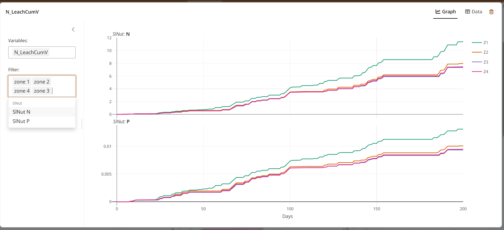

For variables that vary by zone (like `CW_Posgro`, `W_Stock`, `N_CUpt`), all 4 zones are displayed as **colored lines within a single graph**:

| Color | Zone |
|---|---|
| Teal | Zone 1 |
| Orange | Zone 2 |
| Purple | Zone 3 |
| Pink | Zone 4 |

Figure 6.3: Zone × Layer facets
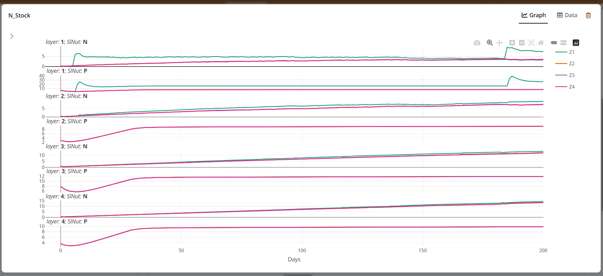

For variables that also vary by layer (like `W_Stock`), the graph shows one **facet per layer**, with 4 zone lines in each facet — so you see all zones at each depth without switching views.

### 6.3 Adding Custom Pages

Click **"Add New Page"** to create a custom output page where you can add cards for any available variable.

### 6.4 Downloading Data

Each graph card has a **Data** tab showing raw values. Use **"Download output data"** on the Simulation page to export everything.

---

## 7. Options

Figure 7.1: Options tab
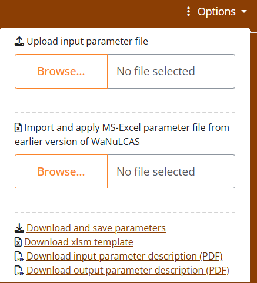

| Action | Description |
|---|---|
| **Upload input parameter file** | Import a previously saved `.yaml` parameter file |
| **Import and apply MS-Excel parameter file** | Import parameters from a `Wanulcas.xlsm`/`.xlsx`/`.xls` file from an earlier version of WaNuLCAS |
| **Download and save parameters** | Export current parameters as a `.yaml` file |
| **Download xlsm template** | Download a blank `Wanulcas.xlsm` to fill in offline |
| **Download input parameter description (PDF)** | Detailed description of every input parameter acronym used in the app |
| **Download output parameter description (PDF)** | Detailed description of every output parameter acronym used in the app |

---

## 8. Frequently Asked Questions

**Q: I changed a parameter but the simulation result didn't change?**
Check the console log in RStudio. It shows the exact values the engine received. If your parameter isn't there, click "Compute & Apply" on the relevant calculator.

**Q: What's the difference between Core and Additional Parameters?**
Core = essential inputs (species, climate, soil), it must be filled for the model to run. Additional = advanced fine-tuning with sensible defaults, depending on the purpose of the research.

**Q: Can I paste data from Excel?**
Yes. Select a block in Excel, copy (Ctrl+C), click the first cell in the web table, and paste (Ctrl+V). Whole rows fill in at once.

**Q: How do I know which soil temperature/evaporation and rainfall type to use?**
There's a guide in the app. Constant = single value (simplest). Monthly = 12 measurements. Daily = 365 measurements (most detailed). The console confirms your choice.

**Q: How do I compare results across zones?**
Zone-dimensioned variables automatically show all 4 zones as colored lines in the same plot (teal/orange/purple/pink).

**Q: Can I download the output data?**
Yes. Click "Download output data" on the Simulation page.

**Q: How do I import parameters from a previous study?**
Go to Options > Upload xlsm file and select your `.xlsm` file.

---
&copy; World Agroforestry (ICRAF)
