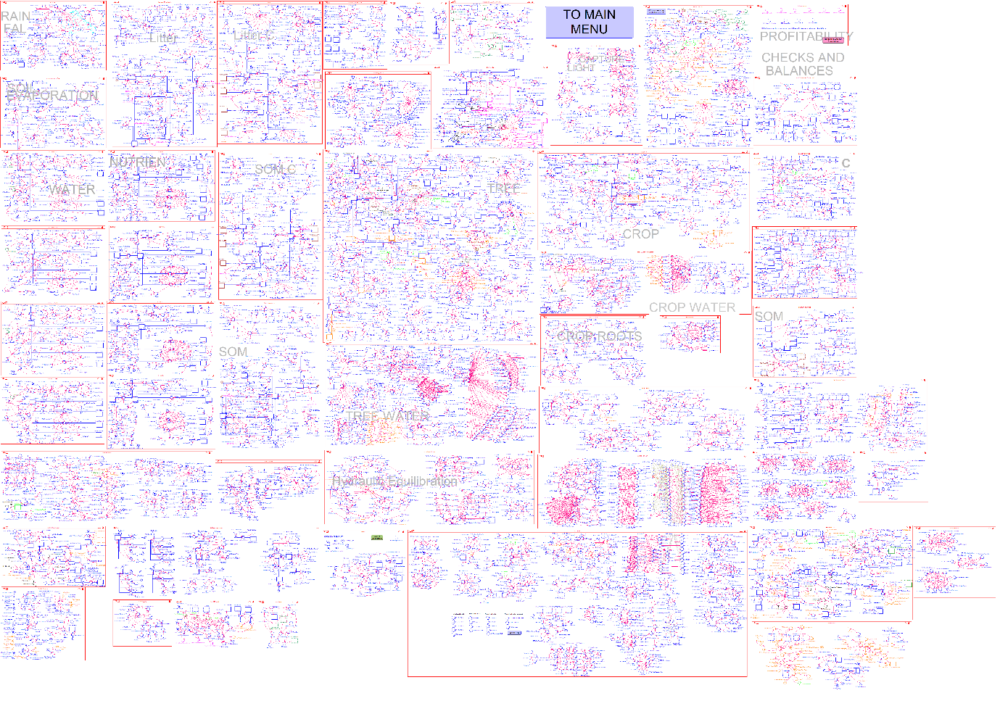
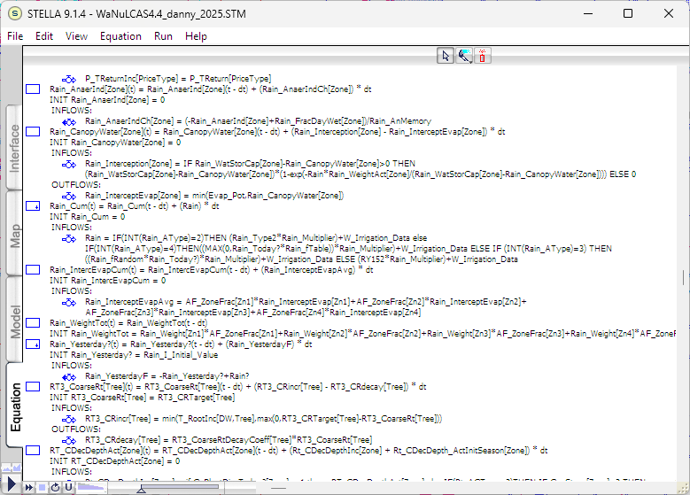
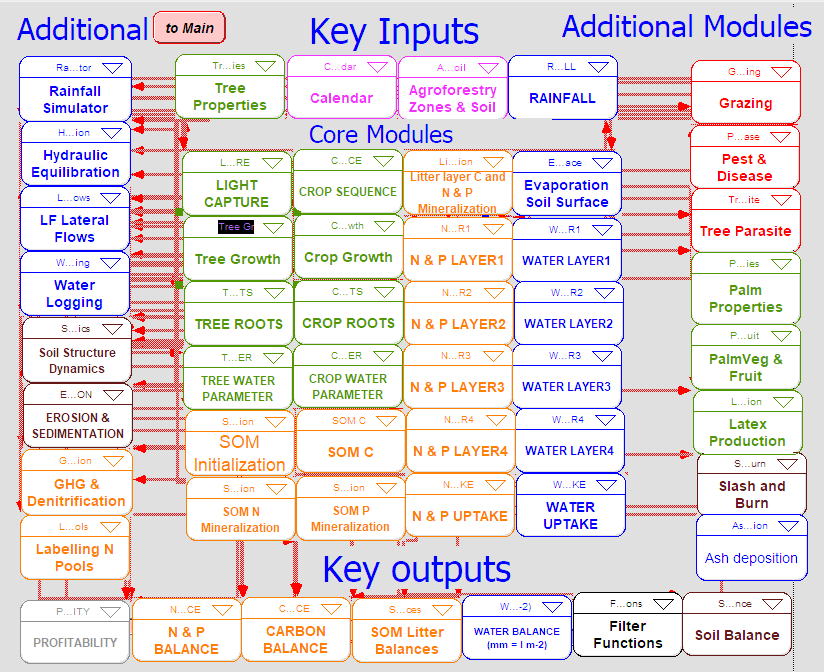
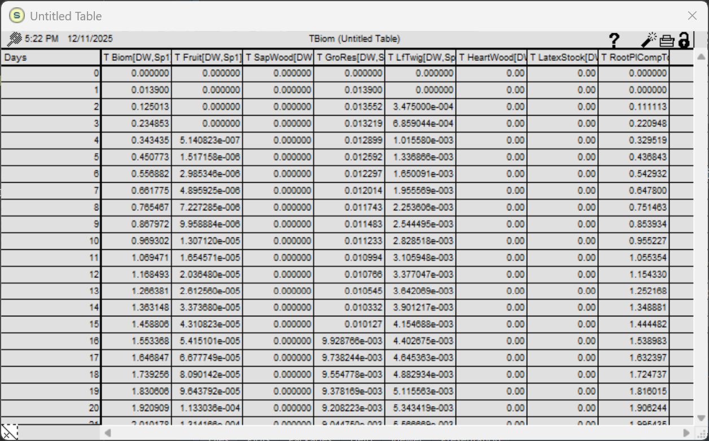
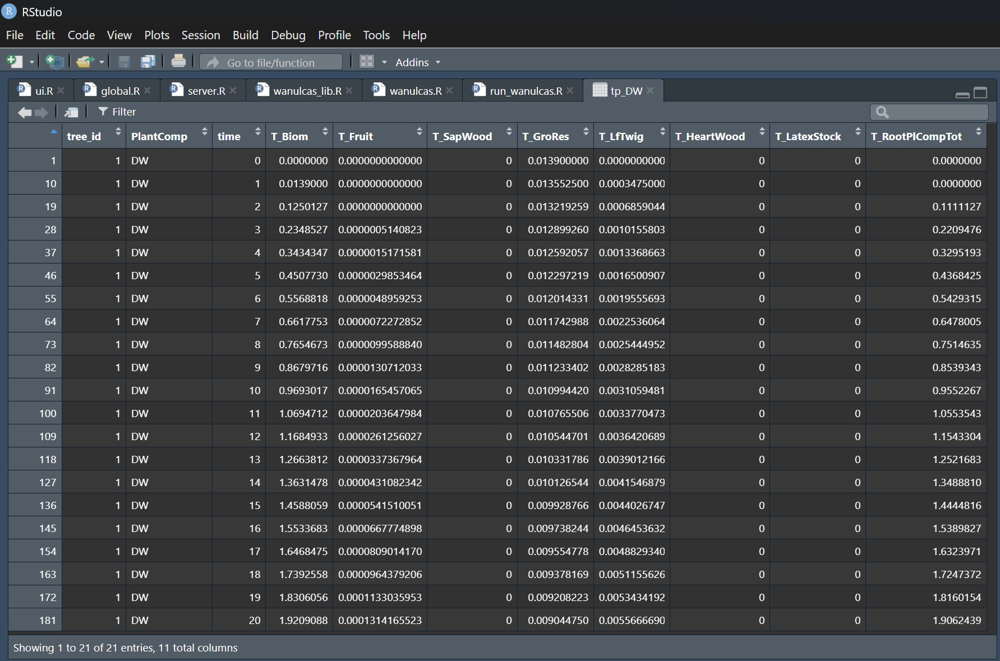
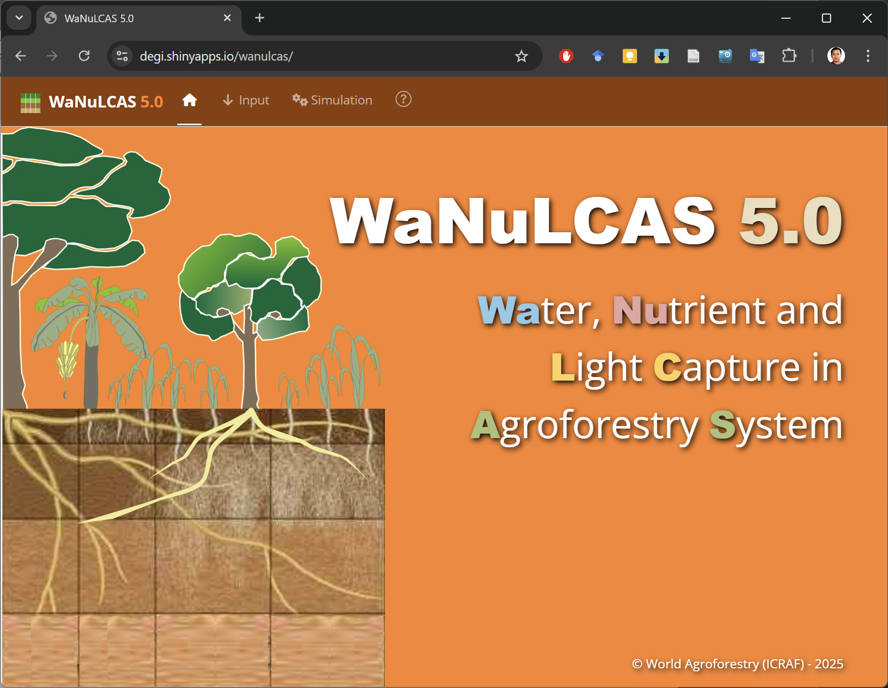
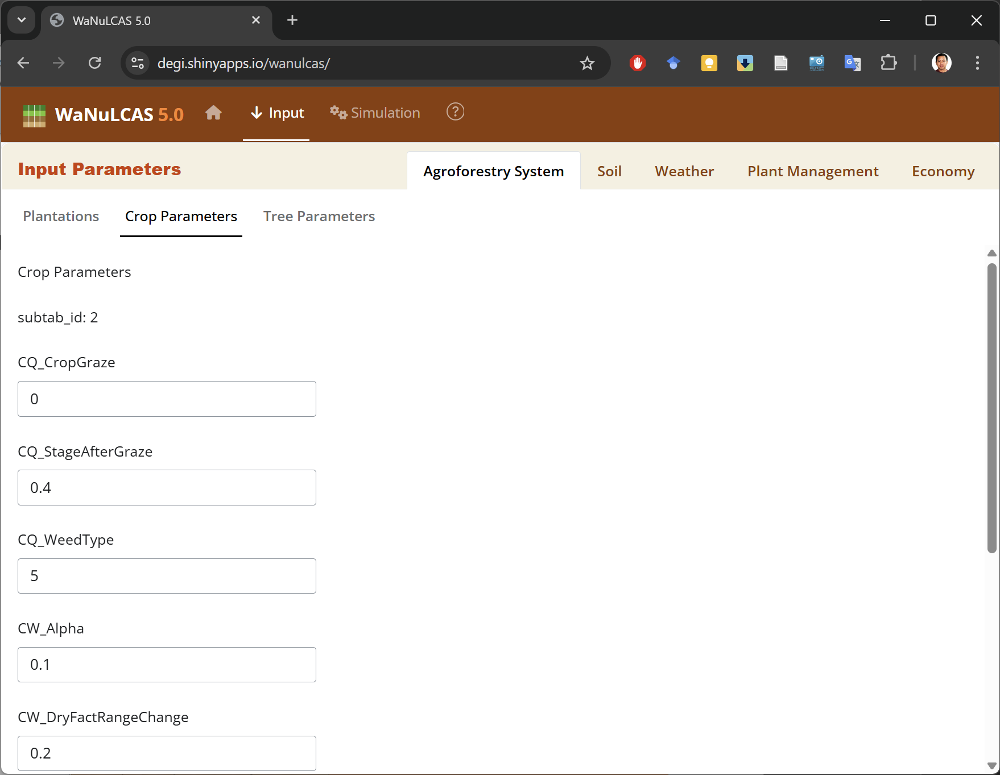
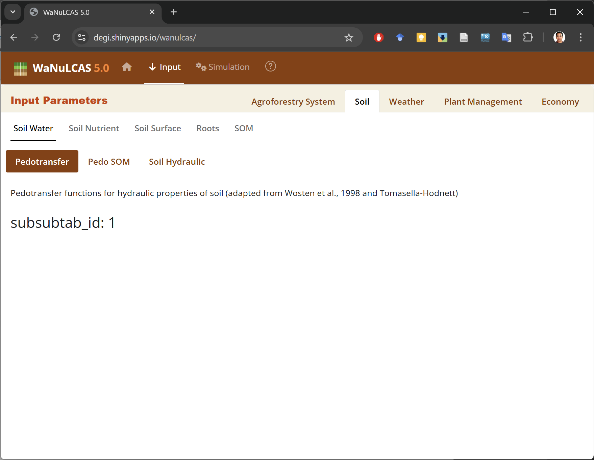

## Background

WaNuLCAS is a model of water, nitrogen, and light interactions in agroforestry systems. Its development began in 1997. The publication of the first version of the WaNuLCAS model was in 1999:

> Van Noordwijk, M. and Lusiana, B., 1999. WaNuLCAS, a model of water,
> nutrient and light capture in agroforestry systems. *Agroforestry
> systems*, *43*(1), pp.217-242.

The model was developed using a System Dynamics (SD) approach with stock and flow modeling. The software platform used for its development is STELLA (short for Systems Thinking, Experimental Learning Laboratory with Animation). STELLA is a visual programming language for system dynamics modeling. Its graphical user interface allows users to create graphical models of a system using four fundamentals: stocks, flows, converters, and connectors. The software produces finite difference equations that describe the graphical model and allows users to select a numerical analysis method to apply to the system.

The STELLA software platform is very practical and easy to use for model development, but it lacks the flexibility of general programming languages. Problems arise when the model grows larger and requires more complex functionality. The platform has limitations regarding data structures and modular function scripting. This makes the graphical model appear complex and harder to manage.

Difficulties also arise in model distribution. STELLA is proprietary software, requiring users to purchase the platform to use the model. They may also need to buy regular updates, as using older software versions can sometimes be problematic on modern computers.

Converting the model to the R ([https://cran.r-project.org/](https://cran.r-project.org/)) and Shiny ([https://shiny.posit.co/](https://shiny.posit.co/)) platforms can be an option for complex models. It offers more flexibility regarding user interface functionality. At the same time, R is free software with a vast collection of statistical libraries. The drawback is that the model flow might not be as intuitively readable as in STELLA's graphical interface, because all equations and algorithms are converted into a scripting language. One must understand R syntax before exploring the script.

However, an R script can still be readable with good data structure and design. Scripts can be split into functions and modules to make them more manageable. R also supports object-oriented programming (OOP), a programming style that uses objects to organize code, making data structures simpler and easier to manage.

Additionally, R-Shiny is a web framework for developing web applications and user interfaces. It can utilize JavaScript plugins and libraries, most of which are available for free. The web apps can be deployed on a Shiny Server and launched from anywhere on any device, provided it has a web browser and an internet connection.

## STELLA Script

The conversion from STELLA to R is not straightforward, especially for a complex model like WaNuLCAS. Data structures must be designed in advance, and equations should be traced one by one. Furthermore, function and module definitions in R differ from those in STELLA.



Figure 1. The visual graphic of the WaNuLCAS system dynamics model on the STELLA platform. The inset provides a zoomed-in example of the Rainfall module within the overall logic map.

Figure 1 displays the visual map of model logic in the STELLA platform. The map illustrates all WaNuLCAS modules,
and the zoomed-in inset gives an impression of the map's size and complexity. The zoomed section is an example of the RAINFALL module.

The logic diagram of the model represents a collection of equations, indicated by nodes. These equations can be viewed on the “Equation” tab in STELLA. Figure 2 shows some of the equations from the WaNuLCAS model. Each line of the script is typically an equation or a flag label. The recent version (v4) of the WaNuLCAS model contains approximately **11,648** lines of equation scripts.



Figure 2. The equation script of the model. The full length of the WaNuLCAS equation
script is 11,648 lines.

These equation scripts must be traced one by one and converted into R scripts. Much of the equation syntax is similar, although R uses more symbolic characters in its code. The major differences lie in data structures and function definitions.

During the WaNuLCAS code conversion process, the original variable naming is retained to make algorithm tracing easier. Some variable names are documented within WaNuLCAS, following a naming convention with specific prefixes for module grouping.

The total number of unique variables extracted from the equation scripts is approximately **7,144**, including arrays. Among those, 7,014 variables use module group acronyms. The highest number of variables falls under the T (tree) category, as shown in Table 1.

| **Acronym** | **Number of Variables** |
| ----------------- | ----------------------------: |
| T                 |                          1078 |
| TF                |                           849 |
| N                 |                           638 |
| Rt                |                           479 |
| W                 |                           384 |
| RT3               |                           368 |
| TW                |                           264 |
| C                 |                           248 |
| Cq                |                           233 |
| Mn2               |                           231 |
| MC2               |                           192 |
| P                 |                           192 |
| CW                |                           159 |
| PD                |                           155 |
| MP2               |                           146 |
| Rain              |                           127 |
| S&B               |                           116 |
| S                 |                           108 |
| AF                |                           103 |
| Mn                |                            94 |
| Mc2               |                            87 |
| Mc                |                            81 |
| BN                |                            65 |
| N15               |                            63 |
| LF                |                            59 |
| GHG               |                            47 |
| Light             |                            46 |
| E                 |                            45 |
| G                 |                            44 |
| BC                |                            42 |
| PF                |                            41 |
| Ca                |                            38 |
| Evap              |                            29 |
| MN2               |                            27 |
| BW                |                            25 |
| TP                |                            25 |
| Cent              |                            16 |
| Cent2             |                            15 |
| BS                |                            13 |
| MNP               |                             8 |
| Temp              |                             8 |
| L                 |                             6 |
| RT                |                             6 |
| Ash               |                             5 |
| MC                |                             5 |
| Rt3               |                             4 |
| **TOTAL**   |                **7014** |

Table 1. Number of variables based on their acronyms

Descriptions of some abbreviations used in variable names are shown in Table 2.

| No   | Acronym | Definition                                               | No   | Acronym | Definition                                        |
| ---- | ------- | -------------------------------------------------------- | ---- | ------- | ------------------------------------------------- |
| 1\.  | AF      | “Agroforestry Zone” – overall design of the system    | 14\. | Mn      | Nutrients in Litter Layer                         |
| 2\.  | C       | Crop (C = Crop, C_N = Crop Nutrient or CW = Crop Water)  | 15\. | Mn2     | Nutrients in Soil Organic Matter (SOM)            |
| 3\.  | Ca      | Crop Calendar (schedule)                                 | 16\. | N       | Nutrient (currently including N and P)            |
| 4\.  | Cent    | Input Output Summary for Litter (based on Century Model) | 17\. | P       | Profitability (economic sector of the model)      |
| 5\.  | Cent2   | Input Output Summary for SOM (based on Century Model)    | 18\. | PD      | Pest and Disease                                  |
| 6\.  | Cq      | Crop Sequence (crop parameters)                          | 19\. | Rain    | Rain                                              |
| 7\.  | E       | Erosion                                                  | 20\. | Rt      | Root                                              |
| 8\.  | Evap    | Evaporation                                              | 21\. | S&B     | Slash and Burn                                    |
| 9\.  | G       | Grazing                                                  | 22\. | S       | Soil Structure                                    |
| 10\. | LF      | Lateral Flow                                             | 23\. | T       | Tree (T=Tree, T_N=Tree Nutrient or TW=Tree Water) |
| 11\. | Light   | Light                                                    | 24\. | TF      | Tree Fruit (oil Palm Module)                      |
| 12\. | Mc      | Carbon in Litter Layer                                   | 25\. | Temp    | Temperature                                       |
| 13\. | Mc2     | Carbon in Soil Organic Matter (SOM)                      | 26\. | W       | Water                                             |

Table 2. Abbreviations used in variable names

## R code conversion

R libraries typically consist of a collection of functions that can be loaded and called to execute various processes. A return value can be a single variable or an object class. An object can contain multiple property values. Certain functions can also be designed for specific object printing or plotting tailored to their intended classes.

An example of a function return object with multiple values is a "data.frame", which is a table-like structure. It can hold various values in a tabular format. Another commonly used object is the "list", which is essentially an array that can contain single values or other objects. A list can hold a data frame or even another list as its elements, allowing for deeply nested data structures.

The code conversion process has taken approximately 6 months. There were about 11,648 lines of STELLA equation code to convert into R scripts. Currently, 100% of the equations have been converted, resulting in around 20,000 lines of R script. Note that this code count applies only to the core programs containing the model's equations.

Progress took longer than initially scheduled, though this was somewhat anticipated given the model's substantial size. The model features approximately 7,144 variables, represented by nodes in the STELLA diagram. The delay was also due to differences in syntax, code development methodologies, and data structures between the two platforms. Consequently, the conversion could not be straightforward and required extra time to redesign the architecture.

The scripts were grouped into modules, as shown in Figure 3. There were 45 modules of model equations, categorised into four main groups: Core Module, Key Inputs, Key Outputs, and Additional Modules.



Figure 3. A diagram of WaNuLCAS modules.

Each module varies in size. Table 3 lists the modules alongside their sizes, expressed as the number of equations. It reveals that the largest modules are “Tree Growth” and “Tree Roots”. The table also tracks code conversion completion progress for each module. Following conversion, the next step involves script testing and model validation.

| Modules                               | Variable Prefix | Number of Equations |
| ------------------------------------- | --------------- | ------------------- |
| **Core Modules**                |                 |                     |
| Light Capture                         | Light, L        | 52                  |
| Tree Growth                           | T, TF           | 948                 |
| Tree Roots                            | Rt, RT3         | 847                 |
| Tree Water Parameter                  | TW              | 264                 |
| Crop Sequence                         | Cq              | 70                  |
| Crop Growth                           | Cq, C           | 511                 |
| Crop Roots                            | Rt              | 40                  |
| Crop Water Parameter                  | CW              | 159                 |
| SOM Initialization                    | Mn2             | 20                  |
| SOM C                                 | Mc2             | 279                 |
| SOM N Mineralization                  | Mn2             | 231                 |
| SOM P Mineralization                  | MP2             | 146                 |
| Litter Layer C and N&P Mineralization | Mc, Mn          | 221                 |
| N & P Layer                           | N               | 533                 |
| N & P Uptake                          | N               | 80                  |
| Evaporation Soil Surface              | Evap, Temp      | 37                  |
| Water Layer                           | W               | 384                 |
| Water Uptake                          | W               | 100                 |
| **Key Inputs**                  |                 |                     |
| Tree Properties                       | T               | 80                  |
| Calendar                              | Ca              | 38                  |
| Agroforestry Zones & Soil             | AF              | 103                 |
| Rainfall                              | Rain            | 127                 |
| **Key Outputs**                 |                 |                     |
| N & P Balance                         | BN              | 65                  |
| Carbon Balance                        | BC              | 42                  |
| SOM Litter Balance                    | Cent            | 31                  |
| Water Balance                         | BW, LF          | 84                  |
| Filter Functions                      | N               | 25                  |
| Soil Balance                          | BS              | 13                  |
| Profitability                         | P, PF           | 233                 |
| **Additional**                  |                 |                     |
| Rainfall Simulator                    | Rain            | 30                  |
| Hydraulic Equilibration               | CW, TW          | 70                  |
| LF Lateral Flows                      | W, LF, AF       | 60                  |
| Water Logging                         | W               | 10                  |
| Soil Structure Dynamics               | S               | 108                 |
| Erosion & Sedimentation               | E               | 45                  |
| GHG & Denitrification                 | GHG             | 47                  |
| Labeling N Pools                      | N15             | 63                  |
| Grazing                               | G               | 44                  |
| Pest & Disease                        | PD              | 155                 |
| Tree Parasite                         | TP              | 25                  |
| Palm Properties                       | TF              | 25                  |
| PalmVeg & Fruit                       | TF              | 824                 |
| Latex Production                      | T               | 50                  |
| Slash and Burn                        | S&B             | 116                 |
| Ash Deposition                        | Ash             | 5                   |

Table 3. Module sizes.

The converted R scripts use similar variable names to the STELLA equation scripts. Mathematical equations also remain largely identical, with only minor differences in syntax and built-in function usage. For reference, the original STELLA equations are copied into the comments of the R code.

Much of the script syntax is similar between STELLA and R, particularly concerning mathematics. Table 4 highlights some syntactical differences between the two platforms.

| **Syntax Type** | **STELLA**   | **R**                    |
| --------------------- | ------------------ | ------------------------------ |
| Assignment            | =                  | \<-                            |
| Logic                 | IF … THEN … ELSE | If(…) … else … and ifelse() |
| Unequal Logic         | \<\>               | !=                             |
| Lowest value          | MIN()              | min() and pmin()               |
| Highest value         | MAX()              | max() and pmax()               |
| Integer value         | INT()              | floor()                        |
| Modulo                | MOD()              | %%                             |

Table 4. Syntax comparison between STELLA and R.

Data structures were redesigned for the R scripts. Instead of simple arrays, a table-like structure known as a Data Frame (syntax: `data.frame()`) is used. A Data Frame can be conceptually viewed as a set of arrays, or a single array if it only contains one column. Data Frames permit multiple dimensions by treating columns as indices, theoretically enabling unlimited dimensionality. This structural shift is crucial, as the original model leverages arrays with many dimensions. Table 5 outlines the array dimensions used in the model.

| **Arrays** | **Dimension Elements**                                                                                                                                                                                           |
| ---------------- | ---------------------------------------------------------------------------------------------------------------------------------------------------------------------------------------------------------------------- |
| Zone             | \[1, 2, 3, 4\]                                                                                                                                                                                                         |
| Layer            | \[1, 2, 3, 4\]                                                                                                                                                                                                         |
| Crop             | \[1, 2, 3, 4, 5\]                                                                                                                                                                                                      |
| Tree             | \[Sp1, Sp2, Sp3\]                                                                                                                                                                                                      |
| SlNut            | \[N, P\]                                                                                                                                                                                                               |
| PlantComp        | \[DW, N, P\]                                                                                                                                                                                                           |
| PriceType        | \[Private, Social\]                                                                                                                                                                                                    |
| Animals          | \[Pigs, Monkeys, Grasshoppers, Nematodes, Goats, Buffalo, Birds\]                                                                                                                                                      |
| Limiting_Factors | \[Water, N, P\]                                                                                                                                                                                                        |
| Cent_Pools       | \[Met, Str, Actv, Slow, Pass\]                                                                                                                                                                                         |
| Fruitbunch       | \[Ripe, Ripe_1, Ripe_2, Ripe_3, Ripe_4, Ripe_5, Ripe_6, Ripe_7, Ripe_8, Ripe_9, Ripe_10, Ripe_11, Ripe_12, Early_fruit, Pollinated, Anthesis, Anthesis_1, Anthesis_2, Anthesis_3, Anthesis_4, Anthesis_5, Anthesis_6\] |
| InsectLifeStage  | \[Larvae, Adults\]                                                                                                                                                                                                     |
| Tree_Stage       | \[VegGen, LeafAge\]                                                                                                                                                                                                    |
| BufValues        | \[1, 2, 3, 4, 5, 6, 7, 8, 9, 10\]                                                                                                                                                                                      |
| ExtOrgInputs     | \[1, 2\]                                                                                                                                                                                                               |
| soil_water       | \[MS, MW, S, W\]                                                                                                                                                                                                       |

Table 5. Array dimension definitions.

After completing the model conversion, the next phase is validating the script logic. Model inputs and outputs will be systematically compared between the STELLA and R versions. Once fully validated, the User Interface will be developed using the R-Shiny platform.

## Source Code Distribution

The source code of the WaNuLCAS app is available on GitHub:

[https://github.com/degi/wanulcas](https://github.com/degi/wanulcas)

The WaNuLCAS core programs are located in the R subfolder:

[https://github.com/degi/wanulcas/tree/main/R](https://github.com/degi/wanulcas/tree/main/R)

The core programs can be downloaded independently and run in either R or RStudio. The execution script is located in the **run_wanulcas.R** file, using the following syntax:

```r
# Make sure the working directory matches the source code location
setwd(dirname(rstudioapi::getActiveDocumentContext()$path))

# Load the program source code
source("wanulcas.R")

# Run the program
output <- run_wanulcas(
  n_iteration = 500,
  xls_input_file = "Wanulcas.xlsm",
  output_vars = default_output_vars
)
```

Once the program finishes running, it returns the results to the "output" variable. This variable contains all the requested variables defined in the "output_vars" parameter and their corresponding values.

## Software Testing and Calibration

The core code has been fully converted into an R script and calibrated using a Coffee Agroforestry model application scenario. Several bugs in both the original STELLA model and the R script were identified and fixed during this calibration. Figure 4 illustrates an example of tree growth scenario output for the STELLA version, while Figure 5 displays the corresponding output for the R version.



Figure 4. WaNuLCAS output for tree biomass growth and corresponding components in the original STELLA version.



Figure 5. WaNuLCAS-R version output for tree biomass growth and corresponding components.

The results show identically matched outputs between the STELLA and R versions for the first 20 days of the simulation. Following these results, the WaNuLCAS-R version is ready to be utilized and tested with other model scenarios.

The core module consists of the following 5 files:

- wanulcas.R
- wanulcas_lib.R
- default_params.yaml
- output_vars.csv
- xls_param_config.csv

Execute the following script to run the model in the R console:

```r
output <- run_wanulcas(n_iteration, wanulcas_params, output_vars)
```

The simulation results will be returned as a List object within the "output" variable. This list contains all output variables and values requested via the "output_vars" function argument.

The core module files can be found at the link below:

[https://github.com/degi/wanulcas/tree/main/R](https://github.com/degi/wanulcas/tree/main/R)

## WaNuLCAS R-Shiny GUI

An R-Shiny GUI prototype has been developed and deployed on a temporary host at [https://www.shinyapps.io](https://www.shinyapps.io/). The web address for the application is [https://degi.shinyapps.io/wanulcas](https://degi.shinyapps.io/wanulcas/). This temporary hosting environment is strictly intended for the development and testing phases. Upon passing all necessary tests, the final application will be deployed to the primary host at [https://agroforestri.id](https://agroforestri.id/).

Screenshots illustrating the WaNuLCAS Shiny app are presented in Figure 6 through Figure 8. The application's interface is divided into tabulated windows. Model parameterization can be achieved either manually through the GUI or by importing a pre-defined parameters file in YAML format.



Figure 6. The homepage of the WaNuLCAS 5.0 R-Shiny application.



Figure 7. The GUI for input parameters.



Figure 8. Input parameters are divided into nested sections and displayed
in tabular windows.

The source code of the application can be found here:

[https://github.com/degi/wanulcas](https://github.com/degi/wanulcas)

## Parameter Input File

Parameter files can be prepared or edited independently of the WaNuLCAS app. The configuration is written in YAML format and is fully accessible via any standard text editor. Customarily, these files have a ".yaml" extension.

YAML stands for “YAML Ain't Markup Language”, a human-friendly data serialization language compatible with any programming language ([https://yaml.org/](https://yaml.org/)). Its formatting relies heavily on indentation levels and common text symbols to define data hierarchy. Consequently, any indentation errors will produce immediate data structure evaluation problems.

The file contains 741 input variables, separated into three categories: 275 single variables, 370 array variables, and 96 graph function variables. The default parameter set encompassing all these variables can be located in the "default_params.yaml" file within the core module. The following is an example snippet of WaNuLCAS parameters formatted in YAML:

```yaml
vars:
  AF_AnyTrees_is: 1
  AF_Circ: 0
  AF_Crop_is: 1
  AF_DeepSubSoil: 3
  AF_DepthDynamic_is: 0
  AF_DepthGroundWater_Table: 0
  AF_DynPestImpacts_is: 0
  AF_PlotNumberUphill: 0
  EVAP_InitSlashM: 0.4
  EVAP_InitWoodM: 0.25
  EVAP_MulchEffSurfLit: 1
  N_Lat4InflowRelConc: 1
  N_LittNmin1exchfact: 0.1
  N_Use_NgassLossEst_is: 0
  T_DCanWidthMax: 22
  T_ExpRetThresh: 30
  T_GrowthResp: 1
arrays:
  crop_df:
    keys:
      crop_id: [1, 2, 3, 4, 5]
    vars:
      C_HostEffForT1: [0, 0, 0, 0, 0]
      C_LAIMax: [10, 5, 5, 5, 10]
      CQ_AgronYieldMoistFrac: [0.65, 0.15, 0.1, 0.1, 0.75]
      CQ_ClosedCanCurr: [0.2, 0.2, 0.2, 0.2, 7.7]
      CQ_GSeedCurr: [0.002, 0.004, 0.01, 0.01, 0.02]
      CQ_HBiomConvCurr: [5, 7, 1.5, 0.01, 0.7]
      CQ_kLightCurr: [0.58, 0.65, 0.6, 0.8, 0.5]
  layer_df:
    keys:
      layer: [1, 2, 3, 4]
    vars:
      AF_DepthLay: [0.2, 0.3, 0.25, 0.25]
      ClayLayer: [24.8, 20, 20.9, 20.9]
      GHG_AnaerobLayerW: [0.6, 0.2, 0.15, 0.05]
      MC2_kRelLayer: [1, 0.8, 0.7, 0.6]
      MC2_SOMDist: [1, 0.2, 0.1, 0.05]
      MN2_PassRelLayer: [1, 1.2, 1.4, 1.6]
      N_KaNH4: [5, 5, 5, 5]
graphs:
  CQ_CropType:
    type: continues
    x_var: CA_ComplCrop
    xy_data:
      CQ_CropType_Zn1:
        x_val: [0, 1, 2, 3, 4, 5, 6, 7, 8, 9, 10, 11, 12, 13, 14, 15, 16, 17, 18, 19, 20]
        y_val: [2, 2, 2, 2, 2, 1, 1, 1, 1, 1, 1, 2, 2, 2, 2, 2, 2, 2, 2, 2, 2]
      CQ_CropType_Zn2:
        x_val: [0, 1, 2, 3, 4, 5, 6, 7, 8, 9, 10, 11, 12, 13, 14, 15, 16, 17, 18, 19, 20]
        y_val: [2, 2, 2, 2, 2, 2, 1, 1, 1, 1, 1, 1, 2, 2, 2, 2, 2, 2, 2, 2, 2]
      CQ_CropType_Zn3:
        x_val: [0, 1, 2, 3, 4, 5, 6, 7, 8, 9, 10, 11, 12, 13, 14, 15, 16, 17, 18, 19, 20]
        y_val: [2, 2, 2, 2, 2, 2, 1, 1, 1, 1, 1, 1, 2, 2, 2, 2, 2, 2, 2, 2, 2]
      CQ_CropType_Zn4:
        x_val: [0, 1, 2, 3, 4, 5, 6, 7, 8, 9, 10, 11, 12, 13, 14, 15, 16, 17, 18, 19, 20]
        y_val: [2, 2, 2, 2, 2, 1, 1, 1, 1, 1, 1, 1, 2, 2, 2, 2, 2, 2, 2, 2, 2]
  T_RestDaysperTappingday:
    type: continues
    x_var: T_DayofYear
    xy_data:
      T_RestDaysperTappingday:
        x_val: [1, 31.3, 61.7, 92, 122, 153, 183, 213, 244, 274, 304, 335, 365]
        y_val: [1, 1, 1, 1, 1, 1, 1, 1, 1, 1, 1, 1, 1]
  T_SlashLabour:
    type: continues
    x_var: T_BiomassSlashed
    xy_data:
      T_SlashLabour:
        x_val: [0, 10, 20, 30, 40, 50, 60, 70, 80, 90, 100]
        y_val: [0, 26, 45, 61, 70, 80, 85, 89, 91, 93, 95]
  T_Temp:
    type: continues
    x_var: T_DayofYear
    xy_data:
      T_Temp:
        x_val: [0, 30.4, 60.8, 91.3, 122, 152, 183, 213, 243, 274, 304, 335, 365]
        y_val: [23.6, 22, 21.6, 22, 23.4, 25, 26.4, 27.4, 29.2, 29.2, 27.8, 25.4, 24]
  T_TempRespMaint:
    type: continues
    x_var: T_Temp
    xy_data:
      T_TempRespMaint:
        x_val: [0, 5, 10, 15, 20, 25, 30, 35, 40, 45, 50]
        y_val: [0.225, 0.25, 0.3, 0.5, 0.725, 1, 1.43, 2, 2.92, 4, 4.97]
```
